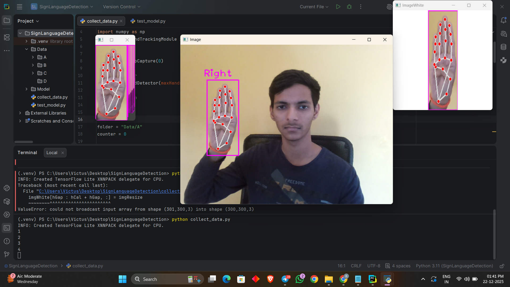
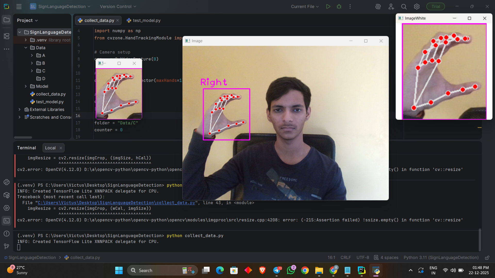
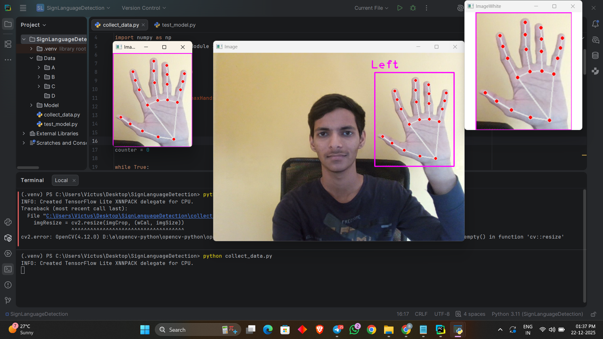
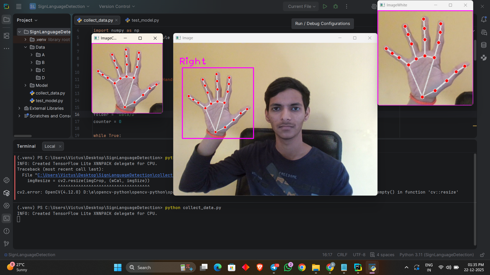
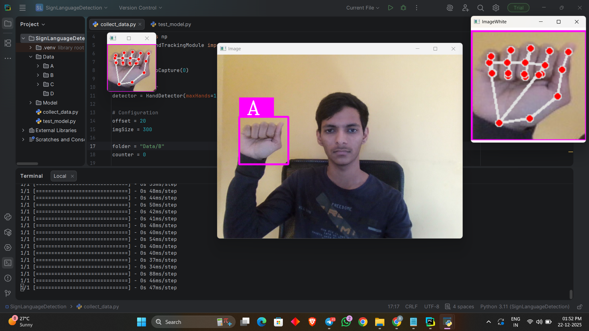
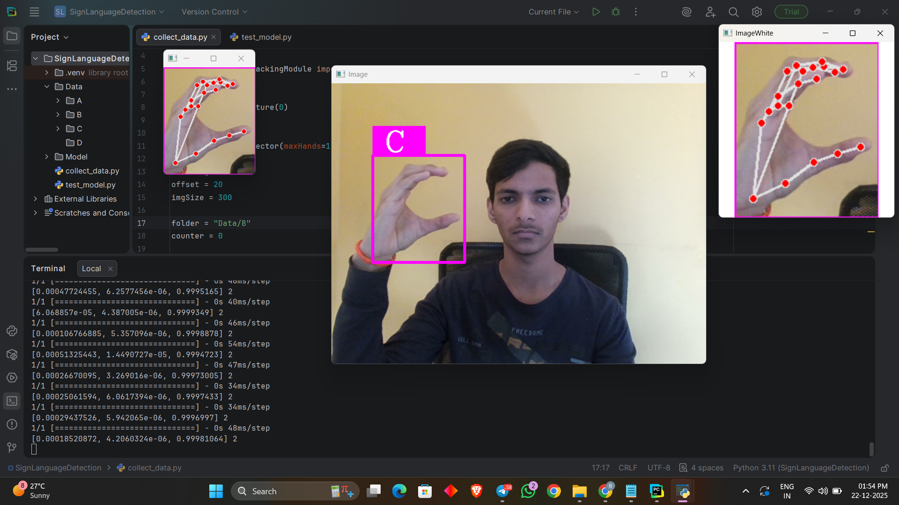

# 🤟 Sign Language Detection Using Hand Gestures

A real-time Sign Language Detection system using **Computer Vision and Deep Learning**.  
The project detects hand gestures via webcam and classifies them into predefined sign language alphabets.

---

## 📌 Features
- Real-time hand detection using webcam
- Image preprocessing with white background normalization
- Deep Learning-based gesture classification
- Supports multiple sign classes (A to Z)
- Simple and efficient Python implementation

---

## 🛠️ Tech Stack
- **Python** 3.11.7  
- **OpenCV** 4.10.0  
- **TensorFlow** 2.12.1  
- **MediaPipe** 0.10.18  
- **CVZone**

---

## 📂 Project Structure
```bash
Sign-Language-Detection/
├── Data/
├── Model/
├── screenshots/
├── data_collection.py
├── testing.py
├── requirements.txt
└── README.md
```

---

## 📸 Project Screenshots

### 🔹 Data Collection




### 🔹 Hand Detection Testing



### 🔹 Successful Gesture Prediction





---

## 🚀 How to Run the Project
```bash
### 1️⃣ Clone the Repository

git clone [https://github.com/bhagyesh-31/sign-language-detection]
cd Sign-Language-Detection
2️⃣ Install Dependencies
bash
Copy code
pip install -r requirements.txt
3️⃣ Collect Data
bash
Copy code
python data_collection.py
Press S to save images.

4️⃣ Test the Model
bash
Copy code
python testing.py


> 🎓 Academic Mini Project – Computer Vision & Deep Learning
